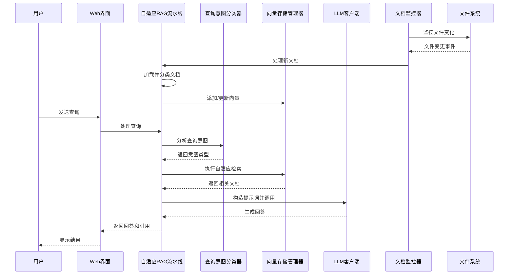

# 自适应RAG系统架构优化设计方案

本文档基于现有的自适应RAG系统，结合用户提供的架构优化建议，提供详细的实现方案。

## 一、架构总览

我们将对现有系统进行模块化优化，围绕"文档加载 → 文档理解 → 查询理解 → 向量检索 → 生成回答 → 用户交互"流程，增强系统的自适应能力、扩展性和性能。

## 二、核心组件优化实现方案

### 1. DocumentLoader（文档加载器）增强

**当前实现分析**：
- 已支持基础格式：TXT、MD、PDF、DOCX、XLSX、CSV
- 简单的OCR支持（通过pytesseract）

**优化实现方案**：

```python
# src/document_loader.py 增强实现
def __init__(self, config=None):
    # 现有代码...
    
    # 添加新的OCR配置
    self.ocr_enabled = getattr(config, 'ENABLE_OCR', True)
    self.ocr_languages = getattr(config, 'OCR_LANGUAGES', 'chi_sim+eng')
    
    # 分块策略配置
    self.chunk_strategies = {
        'semantic': self._semantic_chunking,
        'paragraph': self._paragraph_chunking,
        'sliding_window': self._sliding_window_chunking
    }
    self.default_chunk_strategy = getattr(config, 'DEFAULT_CHUNK_STRATEGY', 'paragraph')

def _semantic_chunking(self, document_text, chunk_size, chunk_overlap):
    """基于语义的分块策略，使用SentenceTransformers计算句子嵌入相似度"""
    try:
        from sentence_transformers import SentenceTransformer
        import numpy as np
        from sklearn.cluster import AgglomerativeClustering
        
        # 加载轻量级嵌入模型
        model = SentenceTransformer('all-MiniLM-L6-v2')
        
        # 分割句子
        sentences = re.split(r'(?<=[。！？.!?])\s*', document_text)
        sentences = [s.strip() for s in sentences if s.strip()]
        
        if len(sentences) <= 1:
            return super().split_text(document_text)
        
        # 计算句子嵌入
        embeddings = model.encode(sentences)
        
        # 计算句子间相似度
        similarities = np.zeros((len(embeddings), len(embeddings)))
        for i in range(len(embeddings)):
            for j in range(i+1, len(embeddings)):
                similarities[i][j] = np.dot(embeddings[i], embeddings[j]) / \
                                    (np.linalg.norm(embeddings[i]) * np.linalg.norm(embeddings[j]))
        
        # 计算相似度差距作为分割点
        gaps = []
        for i in range(len(sentences) - 1):
            gaps.append(1 - similarities[i][i+1])  # 用1-相似度作为间隙大小
        
        # 选择合适的分割点
        chunks = []
        current_chunk = [sentences[0]]
        
        for i, gap in enumerate(gaps):
            # 如果间隙较大或当前块大小接近阈值，分割
            if gap > 0.5 or len(' '.join(current_chunk + [sentences[i+1]])) > chunk_size:
                chunks.append(' '.join(current_chunk))
                current_chunk = [sentences[i+1]]
            else:
                current_chunk.append(sentences[i+1])
        
        if current_chunk:
            chunks.append(' '.join(current_chunk))
            
        return chunks
    except Exception as e:
        logger.warning(f"语义分块失败，回退到默认分块: {str(e)}")
        return super().split_text(document_text)

def _detect_document_metadata(self, file_path, document_text):
    """增强的元数据检测功能"""
    metadata = {
        "source": file_path,
        "file_type": os.path.splitext(file_path)[1].lower(),
        "author": self._extract_author(document_text),
        "create_date": self._extract_creation_date(file_path),
        "processing_time": time.time()
    }
    return metadata

def load_document(self, file_path, chunk_strategy=None):
    # 现有代码...
    
    # 选择分块策略
    strategy = chunk_strategy or self.default_chunk_strategy
    chunk_func = self.chunk_strategies.get(strategy, self._paragraph_chunking)
    
    # 加载文档
    if file_extension == ".html":
        try:
            from langchain_community.document_loaders import UnstructuredHTMLLoader
            loader = UnstructuredHTMLLoader(file_path)
            documents = loader.load()
        except ImportError:
            logger.warning("HTML加载器不可用，尝试使用文本加载器")
            loader = TextLoader(file_path, encoding="utf-8")
            documents = loader.load()
    
    # 增强的OCR处理
    elif file_extension in [".jpg", ".jpeg", ".png", ".gif"] and self.ocr_enabled:
        try:
            # 尝试使用LayoutParser进行布局分析
            try:
                import layoutparser as lp
                image = lp.read(image_path)
                # 这里可以添加更复杂的布局分析
            except ImportError:
                logger.warning("LayoutParser不可用，使用基础OCR")
            
            # 多语言OCR
            text = pytesseract.image_to_string(Image.open(file_path), lang=self.ocr_languages)
            from langchain_core.documents import Document
            
            # 检测元数据
            metadata = self._detect_document_metadata(file_path, text)
            return [Document(page_content=text, metadata=metadata)]
        except Exception as e:
            logger.error(f"图片OCR处理失败: {file_path}, 错误: {str(e)}")
            return []
    
    # 使用选择的分块策略处理文档
    chunks = []
    for doc in documents:
        if file_extension == ".pdf":
            doc_chunks = chunk_func(doc.page_content, 
                                   int(self.config.CHUNK_SIZE * 0.8), 
                                   int(self.config.CHUNK_OVERLAP * 1.2))
        else:
            doc_chunks = chunk_func(doc.page_content, 
                                   self.config.CHUNK_SIZE, 
                                   self.config.CHUNK_OVERLAP)
        
        # 为每个chunk添加元数据
        for i, chunk in enumerate(doc_chunks):
            chunk_metadata = doc.metadata.copy()
            chunk_metadata.update({
                "chunk_id": i,
                "total_chunks": len(doc_chunks),
                "chunk_size": len(chunk)
            })
            chunks.append(Document(page_content=chunk, metadata=chunk_metadata))
    
    return chunks
```

**配置文件更新**：
```yaml
# config/document_processing.yaml
chunking:
  default_strategy: "semantic"
  chunk_size: 1000
  chunk_overlap: 200
  semantic_threshold: 0.5
ocr:
  enabled: true
  languages: "chi_sim+eng"
  use_layout_analysis: true
file_formats:
  supported:
    - extension: ".txt"
      loader: "text"
    - extension: ".pdf"
      loader: "pdf"
      chunk_strategy: "paragraph"
    - extension: ".html"
      loader: "html"
    - extension: ".md"
      loader: "markdown"
```

### 2. DocumentClassifier（文档类型分类器）增强

**当前实现分析**：
- 基于规则的分类系统
- 简单的关键词匹配
- 配置化的文档类型定义

**优化实现方案**：

```python
# src/document_classifier.py 增强实现

def __init__(self, config_path: str = "config/document_types.yaml"):
    # 现有代码...
    
    # 添加机器学习模型支持
    self.ml_model = None
    self.ml_enabled = False
    
    # 加载配置后初始化ML模型
    if self.classification_config.get('ml_enabled', False):
        self._init_ml_model()

def _init_ml_model(self):
    """初始化机器学习分类模型"""
    try:
        import torch
        from transformers import BertTokenizer, BertForSequenceClassification
        
        # 尝试加载预训练模型
        model_path = self.classification_config.get('ml_model_path')
        if model_path and os.path.exists(model_path):
            self.ml_model = BertForSequenceClassification.from_pretrained(model_path)
            self.tokenizer = BertTokenizer.from_pretrained(model_path)
            self.ml_enabled = True
            logger.info(f"成功加载文档分类ML模型: {model_path}")
        else:
            # 尝试使用轻量级模型
            try:
                self.ml_model = BertForSequenceClassification.from_pretrained(
                    "distilbert-base-chinese",
                    num_labels=len(self.document_types)
                )
                self.tokenizer = BertTokenizer.from_pretrained("distilbert-base-chinese")
                self.ml_enabled = True
                logger.info("使用默认轻量级文档分类模型")
            except Exception as e:
                logger.warning(f"无法加载ML模型: {str(e)}")
    except ImportError:
        logger.warning("transformers库不可用，ML分类功能将被禁用")

def _classify_with_ml(self, text: str) -> Dict:
    """使用机器学习模型进行文档分类"""
    if not self.ml_enabled or not self.ml_model:
        return None
    
    try:
        # 预处理文本
        inputs = self.tokenizer(
            text, 
            truncation=True, 
            padding=True, 
            max_length=512,
            return_tensors="pt"
        )
        
        # 模型推理
        with torch.no_grad():
            outputs = self.ml_model(**inputs)
            predictions = torch.nn.functional.softmax(outputs.logits, dim=-1)
            predicted_class = torch.argmax(predictions).item()
            confidence = predictions[0][predicted_class].item()
        
        # 映射到文档类型
        if predicted_class < len(self.document_types):
            doc_type = self.document_types[predicted_class]
            return {
                "type_id": doc_type["id"],
                "type_name": doc_type["name"],
                "confidence": confidence,
                "method": "ml"
            }
        return None
    except Exception as e:
        logger.error(f"ML分类失败: {str(e)}")
        return None

def classify_document(self, document_content: str, metadata: Dict = None) -> Dict:
    """增强的文档分类功能，结合规则和ML"""
    # 获取文本样本
    text_sample = self._get_text_sample(document_content)
    
    # 规则分类结果
    rule_result = self._classify_with_rules(text_sample, metadata)
    
    # ML分类结果
    ml_result = None
    if self.ml_enabled and len(text_sample) > 100:  # 文本足够长时使用ML
        ml_result = self._classify_with_ml(text_sample)
    
    # 合并分类结果
    final_result = self._merge_classification_results(rule_result, ml_result)
    
    # 获取文档类型的处理策略
    processing_strategy = self._get_processing_strategy(final_result["type_id"])
    final_result["processing_strategy"] = processing_strategy
    
    return final_result

def _merge_classification_results(self, rule_result: Dict, ml_result: Dict) -> Dict:
    """合并规则分类和ML分类的结果"""
    # 如果没有ML结果，返回规则结果
    if not ml_result:
        return rule_result
    
    # 如果ML置信度高，优先使用ML结果
    if ml_result["confidence"] > 0.8:
        return ml_result
    
    # 如果两种方法一致，增强置信度
    if rule_result["type_id"] == ml_result["type_id"]:
        merged_confidence = min(1.0, (rule_result["confidence"] + ml_result["confidence"]) / 1.5)
        return {
            "type_id": rule_result["type_id"],
            "type_name": rule_result["type_name"],
            "confidence": merged_confidence,
            "method": "hybrid"
        }
    
    # 否则，选择置信度较高的结果
    if rule_result["confidence"] > ml_result["confidence"]:
        return rule_result
    else:
        return ml_result

def _get_processing_strategy(self, document_type_id: str) -> Dict:
    """根据文档类型获取处理策略"""
    # 查找文档类型对应的处理策略
    for doc_type in self.document_types:
        if doc_type["id"] == document_type_id:
            return doc_type.get("processing_strategy", {})
    
    # 返回默认策略
    return {
        "chunk_size": 1000,
        "chunk_overlap": 200,
        "extract_entities": [],
        "summarize_each_page": False,
        "use_table_extractor": False
    }
```

**配置文件更新**：
```yaml
# config/document_types.yaml
document_types:
  - id: "contract"
    name: "合同文档"
    description: "各类法律合同和协议文件"
    file_extensions: [".docx", ".pdf", ".txt"]
    keywords: ["合同", "协议", "条款", "甲方", "乙方", "签署", "生效", "违约", "责任", "义务"]
    metadata_keys: ["甲方", "乙方", "签署日期", "有效期", "金额"]
    min_keywords_match: 3
    confidence_threshold: 0.6
    processing_strategy:
      chunk_size: 512
      extract_entities: ["甲方", "乙方", "金额", "签署日期", "条款号"]
      summarize_each_page: false
      use_table_extractor: true
      require_rerank: true
  
  - id: "financial_report"
    name: "财务报告"
    description: "财务报表、年报、季报等"
    file_extensions: [".xlsx", ".pdf", ".docx"]
    keywords: ["资产负债表", "利润表", "现金流量表", "财务", "年报", "季报", "收入", "支出", "净利润"]
    min_keywords_match: 2
    confidence_threshold: 0.65
    processing_strategy:
      chunk_size: 1000
      use_table_extractor: true
      summarize_each_page: true
      extract_financial_data: true

classification_config:
  ml_enabled: true
  ml_model_path: "models/offline/document_classifier"
  text_sampling:
    sample_size: 5000
    sample_sections: 3
    min_section_length: 200
  keyword_matching:
    case_sensitive: false
    exact_match_only: false
    use_stemming: true
  hybrid_threshold: 0.75
```

### 3. QueryIntentClassifier（查询意图分类器）增强

**当前实现分析**：
- 基于关键词的意图识别
- 支持多种意图类型：具体细节、概述、比较分析、推理等

**优化实现方案**：

```python
# src/query_intent_classifier.py 增强实现

def __init__(self, config_path: str = None):
    # 现有代码...
    
    # 添加多意图识别支持
    self.multi_intent_enabled = True
    self.intent_combination_rules = {
        "comparison_analysis + reasoning": "comparative_analysis",
        "overview_request + specific_detail": "detailed_summary",
        "application_advice + specific_detail": "implementation_guide"
    }
    
    # 添加LLM辅助分类支持
    self.llm_assisted_classification = False
    
    # 新增意图类型
    self.intent_types.update({
        "multilingual_query": {
            "name": "多语言查询",
            "description": "包含多种语言的查询",
            "keywords": ["in English", "用中文", "翻译成", "翻译为", "英文", "中文", "日文", "韩文"],
            "confidence_threshold": 0.5
        },
        "fact_checking": {
            "name": "事实核查",
            "description": "要求验证或核查某事实",
            "keywords": ["是否正确", "是不是真的", "真的吗", "确认", "核实", "验证", "查证"],
            "confidence_threshold": 0.6
        }
    })

def detect_intent(self, query: str, use_llm_assist: bool = False) -> Dict:
    """增强的意图检测，支持多意图识别和LLM辅助"""
    # 标准化查询
    normalized_query = self._normalize_query(query)
    
    # 基础意图检测
    intent_scores = self._calculate_intent_scores(normalized_query)
    
    # 检测多意图
    detected_intents = self._detect_multiple_intents(intent_scores)
    
    # 如果启用LLM辅助且没有明确意图，使用LLM辅助分类
    if use_llm_assist and len(detected_intents) == 0:
        llm_intent_result = self._detect_intent_with_llm(query)
        if llm_intent_result:
            detected_intents.append(llm_intent_result)
    
    # 映射到RAG策略
    rag_strategy = self._map_intent_to_rag_strategy(detected_intents)
    
    result = {
        "detected_intents": detected_intents,
        "rag_strategy": rag_strategy,
        "query_keywords": self._extract_keywords(normalized_query)
    }
    
    return result

def _detect_multiple_intents(self, intent_scores: Dict[str, float]) -> List[Dict]:
    """检测查询中的多个意图"""
    detected_intents = []
    threshold = 0.3  # 较低的阈值用于多意图检测
    
    # 找出得分高于阈值的所有意图
    scored_intents = []
    for intent_id, score in intent_scores.items():
        if score > threshold and intent_id in self.intent_types:
            scored_intents.append({
                "intent_id": intent_id,
                "intent_name": self.intent_types[intent_id]["name"],
                "score": score
            })
    
    # 按得分排序
    scored_intents.sort(key=lambda x: x["score"], reverse=True)
    
    # 应用置信度阈值
    for intent in scored_intents:
        if intent["score"] >= self.intent_types[intent["intent_id"]]["confidence_threshold"]:
            detected_intents.append(intent)
    
    # 检查意图组合规则
    if len(detected_intents) >= 2:
        combined_intent = self._check_intent_combinations(detected_intents)
        if combined_intent:
            return [combined_intent]  # 返回组合后的意图
    
    return detected_intents

def _check_intent_combinations(self, detected_intents: List[Dict]) -> Dict:
    """检查是否有匹配的意图组合规则"""
    intent_ids = [i["intent_id"] for i in detected_intents[:2]]  # 仅检查前两个意图
    
    # 尝试所有组合顺序
    for i in range(len(intent_ids)):
        for j in range(len(intent_ids)):
            if i != j:
                combination_key = f"{intent_ids[i]} + {intent_ids[j]}"
                if combination_key in self.intent_combination_rules:
                    combined_id = self.intent_combination_rules[combination_key]
                    return {
                        "intent_id": combined_id,
                        "intent_name": f"{self.intent_types[intent_ids[i]]["name"]} + {self.intent_types[intent_ids[j]]["name"]}",
                        "score": (detected_intents[i]["score"] + detected_intents[j]["score"]) / 2,
                        "is_combined": True,
                        "original_intents": [detected_intents[i], detected_intents[j]]
                    }
    
    return None

def _detect_intent_with_llm(self, query: str) -> Dict:
    """使用LLM辅助进行意图检测"""
    try:
        # 延迟导入以避免循环依赖
        from src.llm_client import llm_client
        
        prompt = f"""分析以下用户查询的意图，从预定义的意图类型中选择最匹配的一个：

用户查询: {query}

预定义意图类型：
{', '.join([f'{intent_id}: {info["name"]}' for intent_id, info in self.intent_types.items()])}

请以JSON格式返回：
{
  "intent_id": "选择的意图ID",
  "confidence": 0-1之间的置信度,
  "reason": "选择此意图的简要理由"
}
"""
        
        # 调用LLM获取意图
        response = llm_client.generate_response(prompt, temperature=0.1)
        
        # 解析响应
        import json
        result = json.loads(response)
        
        return {
            "intent_id": result["intent_id"],
            "intent_name": self.intent_types.get(result["intent_id"], {"name": "未知"})["name"],
            "score": result["confidence"],
            "method": "llm"
        }
    except Exception as e:
        logger.error(f"LLM辅助意图检测失败: {str(e)}")
        return None

def _map_intent_to_rag_strategy(self, detected_intents: List[Dict]) -> str:
    """将检测到的意图映射到RAG策略"""
    if not detected_intents:
        return "default"
    
    # 意图到策略的映射
    intent_to_strategy = {
        "specific_detail": "fact_qa",
        "overview_request": "summary",
        "comparison_analysis": "compare",
        "reasoning": "reasoning",
        "application_advice": "instruction",
        "list_collection": "list",
        "yes_no_question": "fact_qa",
        "multilingual_query": "multilingual",
        "fact_checking": "fact_qa",
        "comparative_analysis": "compare",
        "detailed_summary": "summary",
        "implementation_guide": "instruction"
    }
    
    # 优先使用主要意图的策略
    main_intent = detected_intents[0]
    return intent_to_strategy.get(main_intent["intent_id"], "default")
```

### 4. VectorStoreManager（向量存储管理器）增强

**当前实现分析**：
- 使用Chroma作为向量数据库
- 支持SentenceTransformers嵌入模型
- 简单的重排序功能

**优化实现方案**：

```python
# src/vector_store.py 增强实现

def __init__(self, config=None):
    # 现有代码...
    
    # 添加混合检索支持
    self.hybrid_search_enabled = getattr(config, 'ENABLE_HYBRID_SEARCH', False)
    
    # 初始化HNSW索引（如果支持）
    self.use_hnsw_index = getattr(config, 'USE_HNSW_INDEX', False)
    
    # 去重配置
    self.deduplication_enabled = getattr(config, 'ENABLE_DEDUPLICATION', True)
    self.deduplication_threshold = getattr(config, 'DEDUPLICATION_THRESHOLD', 0.95)
    
    # 初始化TTL管理
    self.ttl_enabled = getattr(config, 'ENABLE_TTL', False)
    self.default_ttl = getattr(config, 'DEFAULT_TTL', 30)  # 天

def _init_vector_store(self):
    """初始化向量存储，增强HNSW索引支持"""
    try:
        # 获取向量存储路径
        vector_store_path = getattr(self.config, 'VECTOR_STORE_PATH', 'vectorstore')
        
        # 创建向量存储配置
        collection_name = getattr(self.config, 'VECTOR_STORE_COLLECTION', 'default')
        
        # 尝试使用HNSW索引
        if self.use_hnsw_index:
            try:
                # 如果使用自定义索引参数
                embedding_dim = self._get_embedding_dimension()
                
                self.vector_store = Chroma(
                    collection_name=collection_name,
                    embedding_function=self.embeddings,
                    persist_directory=vector_store_path,
                    # 添加索引参数（如果Chroma支持）
                    collection_metadata={
                        "hnsw:space": "cosine",
                        "hnsw:M": 16,
                        "hnsw:ef_construction": 200
                    }
                )
                logger.info("使用HNSW索引初始化向量存储")
            except Exception as e:
                logger.warning(f"HNSW索引初始化失败，使用标准配置: {str(e)}")
                # 回退到标准初始化
                self.vector_store = Chroma(
                    collection_name=collection_name,
                    embedding_function=self.embeddings,
                    persist_directory=vector_store_path
                )
        else:
            # 标准初始化
            self.vector_store = Chroma(
                collection_name=collection_name,
                embedding_function=self.embeddings,
                persist_directory=vector_store_path
            )
        
        logger.info(f"向量存储初始化完成，集合名: {collection_name}")
    except Exception as e:
        logger.error(f"向量存储初始化失败: {str(e)}")
        raise

def _get_embedding_dimension(self):
    """获取嵌入向量的维度"""
    try:
        # 使用示例文本获取维度
        sample_embedding = self.embeddings.embed_query("示例文本")
        return len(sample_embedding)
    except Exception:
        return 768  # 默认维度

def add_documents(self, documents, metadata=None, batch_size=100):
    """增强的文档添加功能，支持去重和TTL"""
    # 处理元数据和TTL
    documents_with_metadata = []
    for doc in documents:
        # 复制文档以避免修改原始文档
        doc_copy = copy.deepcopy(doc)
        
        # 添加默认元数据
        if "added_at" not in doc_copy.metadata:
            doc_copy.metadata["added_at"] = time.time()
        
        # 添加TTL信息
        if self.ttl_enabled and "expires_at" not in doc_copy.metadata:
            doc_copy.metadata["expires_at"] = time.time() + (self.default_ttl * 24 * 60 * 60)
        
        # 合并额外元数据
        if metadata:
            doc_copy.metadata.update(metadata)
        
        documents_with_metadata.append(doc_copy)
    
    # 如果启用去重，执行去重操作
    if self.deduplication_enabled and documents_with_metadata:
        unique_documents = self._deduplicate_documents(documents_with_metadata)
    else:
        unique_documents = documents_with_metadata
    
    # 批量添加文档
    if not unique_documents:
        logger.info("没有要添加的唯一文档")
        return []
    
    logger.info(f"添加 {len(unique_documents)} 个文档到向量存储")
    
    # 分批处理大文档集
    all_ids = []
    for i in range(0, len(unique_documents), batch_size):
        batch = unique_documents[i:i+batch_size]
        try:
            ids = self.vector_store.add_documents(batch)
            all_ids.extend(ids)
        except Exception as e:
            logger.error(f"添加文档批次失败 (批次 {i//batch_size + 1}/{(len(unique_documents)-1)//batch_size + 1}): {str(e)}")
    
    # 持久化向量存储
    try:
        self.vector_store.persist()
    except Exception as e:
        logger.warning(f"向量存储持久化失败: {str(e)}")
    
    return all_ids

def _deduplicate_documents(self, documents):
    """基于内容相似度的文档去重"""
    if not documents:
        return []
    
    unique_documents = []
    processed_embeddings = []
    
    for doc in documents:
        # 计算文档嵌入
        doc_embedding = self.embeddings.embed_query(doc.page_content)
        
        # 检查是否与已处理文档相似
        is_duplicate = False
        for i, existing_emb in enumerate(processed_embeddings):
            # 计算余弦相似度
            similarity = self._cosine_similarity(doc_embedding, existing_emb)
            
            if similarity > self.deduplication_threshold:
                is_duplicate = True
                logger.info(f"检测到重复文档，相似度: {similarity:.4f}")
                # 保留最新的文档元数据
                if "added_at" in doc.metadata and "added_at" in unique_documents[i].metadata:
                    if doc.metadata["added_at"] > unique_documents[i].metadata["added_at"]:
                        # 更新保留文档的元数据
                        for key, value in doc.metadata.items():
                            if key not in unique_documents[i].metadata:
                                unique_documents[i].metadata[key] = value
                break
        
        if not is_duplicate:
            unique_documents.append(doc)
            processed_embeddings.append(doc_embedding)
    
    logger.info(f"去重后剩余 {len(unique_documents)} 个文档 (原 {len(documents)} 个)")
    return unique_documents

def _cosine_similarity(self, vec1, vec2):
    """计算两个向量的余弦相似度"""
    import numpy as np
    
    if not vec1 or not vec2:
        return 0
    
    # 转换为numpy数组
    arr1 = np.array(vec1)
    arr2 = np.array(vec2)
    
    # 计算点积
    dot_product = np.dot(arr1, arr2)
    
    # 计算向量范数
    norm1 = np.linalg.norm(arr1)
    norm2 = np.linalg.norm(arr2)
    
    # 避免除以零
    if norm1 == 0 or norm2 == 0:
        return 0
    
    # 返回余弦相似度
    return dot_product / (norm1 * norm2)

def similarity_search(self, query, k=5, filter=None, hybrid=False):
    """增强的相似度搜索，支持混合检索"""
    # 先清理过期文档（如果启用TTL）
    if self.ttl_enabled:
        self._clean_expired_documents()
    
    # 如果请求混合检索且已启用
    if hybrid and self.hybrid_search_enabled:
        return self._hybrid_search(query, k, filter)
    
    # 标准向量相似度搜索
    try:
        results = self.vector_store.similarity_search_with_relevance_scores(
            query, 
            k=k, 
            filter=filter
        )
        
        # 应用重排序（如果可用）
        if self.reranker and len(results) > 1:
            return self._rerank_results(query, results)
        
        return results
    except Exception as e:
        logger.error(f"相似度搜索失败: {str(e)}")
        return []

def _hybrid_search(self, query, k=5, filter=None):
    """混合关键词和向量检索"""
    try:
        # 向量搜索结果
        vector_results = self.vector_store.similarity_search_with_relevance_scores(
            query, 
            k=k*2,  # 获取更多结果用于混合
            filter=filter
        )
        
        # 简单的关键词匹配（可以用更复杂的实现）
        keyword_matches = self._keyword_search(query, filter)
        
        # 合并结果，给关键词匹配更高权重
        combined_results = {}
        
        # 添加向量搜索结果
        for doc, score in vector_results:
            doc_id = str(doc.metadata.get("source", "") + str(doc.metadata.get("chunk_id", "")))
            combined_results[doc_id] = {
                "document": doc,
                "vector_score": score,
                "keyword_score": 0
            }
        
        # 添加关键词匹配结果
        for doc in keyword_matches:
            doc_id = str(doc.metadata.get("source", "") + str(doc.metadata.get("chunk_id", "")))
            if doc_id in combined_results:
                combined_results[doc_id]["keyword_score"] = 0.8  # 关键词匹配得分
            else:
                combined_results[doc_id] = {
                    "document": doc,
                    "vector_score": 0.1,  # 基础分
                    "keyword_score": 0.8
                }
        
        # 计算综合得分
        final_results = []
        for result in combined_results.values():
            # 加权综合得分
            final_score = (result["vector_score"] * 0.6) + (result["keyword_score"] * 0.4)
            final_results.append((result["document"], final_score))
        
        # 排序并返回前k个结果
        final_results.sort(key=lambda x: x[1], reverse=True)
        return final_results[:k]
    
    except Exception as e:
        logger.error(f"混合检索失败: {str(e)}")
        # 回退到标准向量搜索
        return self.vector_store.similarity_search_with_relevance_scores(query, k=k, filter=filter)

def _keyword_search(self, query, filter=None):
    """简单的关键词搜索实现"""
    # 提取关键词
    import re
    keywords = re.findall(r'\b\w+\b', query.lower())
    keywords = list(set(keywords))[:10]  # 最多10个关键词
    
    if not keywords:
        return []
    
    # 获取所有文档并进行简单过滤
    # 在生产环境中，应该使用更高效的实现
    try:
        all_docs = self.vector_store.get()
        matches = []
        
        for i, content in enumerate(all_docs["documents"]):
            content_lower = content.lower()
            match_count = sum(1 for keyword in keywords if keyword in content_lower)
            
            if match_count > 0:
                # 创建文档对象
                from langchain_core.documents import Document
                metadata = {}
                for key, values in all_docs["metadatas"][i].items():
                    metadata[key] = values
                
                doc = Document(page_content=content, metadata=metadata)
                matches.append(doc)
        
        # 返回前20个匹配
        return matches[:20]
    except Exception as e:
        logger.error(f"关键词搜索失败: {str(e)}")
        return []

def _clean_expired_documents(self):
    """清理过期文档"""
    try:
        current_time = time.time()
        
        # 查找所有文档
        all_docs = self.vector_store.get()
        expired_ids = []
        
        for i, metadata in enumerate(all_docs["metadatas"]):
            if isinstance(metadata, dict) and "expires_at" in metadata:
                try:
                    expires_at = float(metadata["expires_at"])
                    if current_time > expires_at:
                        expired_ids.append(all_docs["ids"][i])
                except (ValueError, TypeError):
                    continue
        
        # 删除过期文档
        if expired_ids:
            logger.info(f"删除 {len(expired_ids)} 个过期文档")
            self.vector_store.delete(ids=expired_ids)
            self.vector_store.persist()
    
    except Exception as e:
        logger.error(f"清理过期文档失败: {str(e)}")
```

**配置文件更新**：
```yaml
# config/vector_store.yaml
vector_store:
  type: "chroma"
  path: "vectorstore"
  collection: "default"
  use_hnsw_index: true
  hybrid_search_enabled: true
  embedding:
    model: "BAAI/bge-large-zh-v1.5"
    local_path: "models/offline/bge-large-zh-v1.5"
  deduplication:
    enabled: true
    threshold: 0.95
  ttl:
    enabled: true
    default_days: 30
  reranking:
    enabled: true
    model: "BAAI/bge-reranker-large"
    weight: 0.3
```

### 5. LLMClient（大语言模型客户端）增强

**当前实现分析**：
- 支持多种模型提供商：DeepSeek、OpenAI、Qwen、Moonshot、Spark
- 基础的请求处理和错误处理

**优化实现方案**：

```python
# src/llm_client.py 增强实现

class ModelConfig:
    """模型配置类"""
    def __init__(self, provider, name, url=None, api_key_name=None, 
                 max_tokens=2048, temperature=0.1, supports_stream=True,
                 default_for=None):
        self.provider = provider
        self.name = name
        self.url = url
        self.api_key_name = api_key_name
        self.max_tokens = max_tokens
        self.temperature = temperature
        self.supports_stream = supports_stream
        self.default_for = default_for or []

class LLMClientFactory:
    """LLM客户端工厂，支持模型路由和缓存"""
    
    def __init__(self, config=None):
        self.config = config or global_config
        self.clients = {}
        self.model_configs = self._load_model_configs()
        self.cache = None
        
        # 初始化缓存
        self._init_cache()
    
    def _init_cache(self):
        """初始化响应缓存"""
        try:
            # 尝试使用Redis作为缓存
            import redis
            redis_url = os.getenv("REDIS_URL", "redis://localhost:6379/0")
            
            try:
                self.cache = redis.Redis.from_url(redis_url)
                self.cache.ping()
                logger.info("使用Redis作为LLM响应缓存")
            except (redis.ConnectionError, ImportError):
                # 回退到内存缓存
                from functools import lru_cache
                from src.utils.cache import SimpleMemoryCache
                self.cache = SimpleMemoryCache(max_size=1000, ttl=3600)
                logger.info("使用内存缓存作为LLM响应缓存")
        except Exception as e:
            logger.warning(f"初始化缓存失败: {str(e)}")
            self.cache = None
    
    def _load_model_configs(self):
        """加载所有模型配置"""
        configs = {}
        
        # 定义默认模型配置
        default_configs = [
            ModelConfig(
                provider="deepseek",
                name="deepseek-chat",
                url="https://api.deepseek.com/v1/chat/completions",
                api_key_name="DEEPSEEK_API_KEY",
                max_tokens=4096,
                temperature=0.1,
                supports_stream=True
            ),
            ModelConfig(
                provider="qwen",
                name="qwen-max",
                url="https://dashscope.aliyuncs.com/compatible-mode/v1/chat/completions",
                api_key_name="QWEN_API_KEY",
                max_tokens=8192,
                temperature=0.1,
                supports_stream=True,
                default_for=["summary", "fact_qa"]
            ),
            ModelConfig(
                provider="openai",
                name="gpt-3.5-turbo",
                url="https://api.openai.com/v1/chat/completions",
                api_key_name="OPENAI_API_KEY",
                max_tokens=4096,
                temperature=0.1,
                supports_stream=True
            ),
            ModelConfig(
                provider="openai",
                name="gpt-4",
                url="https://api.openai.com/v1/chat/completions",
                api_key_name="OPENAI_API_KEY",
                max_tokens=8192,
                temperature=0.3,
                supports_stream=True,
                default_for=["reasoning", "complex_analysis"]
            )
        ]
        
        # 加载配置文件中的模型配置
        try:
            config_path = os.path.join("config", "llm_models.yaml")
            if os.path.exists(config_path):
                import yaml
                with open(config_path, 'r', encoding='utf-8') as f:
                    yaml_config = yaml.safe_load(f)
                    if yaml_config and 'models' in yaml_config:
                        for model_data in yaml_config['models']:
                            config = ModelConfig(
                                provider=model_data.get('provider'),
                                name=model_data.get('name'),
                                url=model_data.get('url'),
                                api_key_name=model_data.get('api_key_name'),
                                max_tokens=model_data.get('max_tokens', 2048),
                                temperature=model_data.get('temperature', 0.1),
                                supports_stream=model_data.get('supports_stream', True),
                                default_for=model_data.get('default_for', [])
                            )
                            key = f"{config.provider}:{config.name}"
                            configs[key] = config
        except Exception as e:
            logger.warning(f"加载模型配置文件失败: {str(e)}")
            # 使用默认配置
            for config in default_configs:
                key = f"{config.provider}:{config.name}"
                configs[key] = config
        
        # 如果配置为空，使用默认配置
        if not configs:
            for config in default_configs:
                key = f"{config.provider}:{config.name}"
                configs[key] = config
        
        return configs
    
    def get_client(self, provider=None, model_name=None, strategy=None):
        """获取LLM客户端，支持基于策略的路由"""
        # 如果没有指定模型，基于策略选择
        if not provider or not model_name:
            provider, model_name = self._select_model(strategy)
        
        # 检查客户端是否已存在
        key = f"{provider}:{model_name}"
        if key not in self.clients:
            # 创建新客户端
            self.clients[key] = self._create_client(provider, model_name)
        
        return self.clients[key]
    
    def _select_model(self, strategy=None):
        """基于策略选择合适的模型"""
        # 优先选择策略默认模型
        if strategy:
            for config in self.model_configs.values():
                if strategy in config.default_for:
                    return config.provider, config.name
        
        # 默认选择第一个可用模型
        if self.model_configs:
            first_config = next(iter(self.model_configs.values()))
            return first_config.provider, first_config.name
        
        # 回退到deepseek
        return "deepseek", "deepseek-chat"
    
    def _create_client(self, provider, model_name):
        """创建特定类型的LLM客户端"""
        key = f"{provider}:{model_name}"
        config = self.model_configs.get(key)
        
        if not config:
            logger.error(f"未知的模型配置: {key}")
            # 使用默认配置
            provider = "deepseek"
            model_name = "deepseek-chat"
            config = ModelConfig(
                provider=provider,
                name=model_name,
                url="https://api.deepseek.com/v1/chat/completions",
                api_key_name="DEEPSEEK_API_KEY"
            )
        
        # 获取API密钥
        api_key = getattr(self.config, config.api_key_name, os.getenv(config.api_key_name))
        
        # 根据提供商创建客户端
        if provider == "deepseek":
            return DeepSeekClient(config, api_key)
        elif provider == "qwen":
            return QwenClient(config, api_key)
        elif provider == "openai":
            return OpenAIClient(config, api_key)
        elif provider == "moonshot":
            return MoonshotClient(config, api_key)
        elif provider == "spark":
            return SparkClient(config, api_key)
        else:
            logger.warning(f"不支持的提供商: {provider}，使用DeepSeek作为回退")
            return DeepSeekClient(config, api_key)

# 添加统一的客户端基类
class BaseLLMClient:
    """LLM客户端基类"""
    
    def __init__(self, config, api_key):
        self.config = config
        self.api_key = api_key
        self.headers = {
            "Authorization": f"Bearer {api_key}",
            "Content-Type": "application/json"
        }
        self.session = self._create_session()
    
    def _create_session(self):
        """创建HTTP会话，配置重试策略"""
        session = requests.Session()
        retry_strategy = Retry(
            total=3,
            backoff_factor=0.5,
            status_forcelist=[429, 500, 502, 503, 504],
            allowed_methods=["POST"]
        )
        adapter = HTTPAdapter(max_retries=retry_strategy)
        session.mount("https://", adapter)
        session.mount("http://", adapter)
        return session
    
    @abstractmethod
    def generate_response(self, prompt, **kwargs):
        """生成文本响应"""
        pass
    
    def stream_response(self, prompt, **kwargs):
        """流式生成文本响应"""
        pass
    
    def generate_structured_output(self, prompt, schema=None, **kwargs):
        """生成结构化输出"""
        pass
    
    def truncate_context(self, context, max_tokens=8000):
        """智能截断上下文，避免超过模型限制"""
        # 简单的字符计数实现，生产环境中应使用token计数
        avg_token_length = 1.5  # 平均每个token的字符数
        max_chars = int(max_tokens * avg_token_length * 0.8)  # 留出20%余量
        
        if len(context) <= max_chars:
            return context
        
        # 尝试保留首尾重要信息
        half_max = max_chars // 2
        return context[:half_max] + "\n[...内容被截断...]\n" + context[-half_max:]
    
    def get_cache_key(self, prompt, **kwargs):
        """生成缓存键"""
        cache_data = {
            "prompt": prompt,
            "model": f"{self.config.provider}:{self.config.name}",
            **kwargs
        }
        return hashlib.md5(str(cache_data).encode()).hexdigest()

# 然后实现各种具体客户端...
```

**配置文件更新**：
```yaml
# config/llm_models.yaml
models:
  - name: "deepseek-chat"
    provider: "deepseek"
    url: "https://api.deepseek.com/v1/chat/completions"
    api_key_name: "DEEPSEEK_API_KEY"
    max_tokens: 4096
    temperature: 0.3
    supports_stream: true
    default_for: []
  
  - name: "qwen-max"
    provider: "qwen"
    url: "https://dashscope.aliyuncs.com/compatible-mode/v1/chat/completions"
    api_key_name: "QWEN_API_KEY"
    max_tokens: 8192
    temperature: 0.1
    supports_stream: true
    default_for: ["summary", "fact_qa", "multilingual"]
  
  - name: "gpt-3.5-turbo"
    provider: "openai"
    url: "https://api.openai.com/v1/chat/completions"
    api_key_name: "OPENAI_API_KEY"
    max_tokens: 4096
    temperature: 0.1
    supports_stream: true
    default_for: []
  
  - name: "gpt-4"
    provider: "openai"
    url: "https://api.openai.com/v1/chat/completions"
    api_key_name: "OPENAI_API_KEY"
    max_tokens: 8192
    temperature: 0.3
    supports_stream: true
    default_for: ["reasoning", "complex_analysis", "compare"]

cache:
  enabled: true
  type: "redis"  # redis或memory
  redis_url: "redis://localhost:6379/0"
  memory_max_size: 1000
  ttl_seconds: 3600

routing:
  default_model: "qwen-max"
  strategies:
    simple_query: "qwen-max"
    complex_analysis: "gpt-4"
    multilingual: "qwen-max"
```

### 6. AdaptiveRAGPipeline（自适应RAG流水线）增强

**当前实现分析**：
- 根据文档类型和查询意图选择RAG策略
- 支持多种提示模板

**优化实现方案**：

```python
# src/adaptive_rag_pipeline.py 增强实现

def __init__(self, config_path: str = "config/rag_strategies.yaml"):
    # 现有代码...
    
    # 添加失败处理和降级机制
    self.failover_enabled = True
    self.failover_strategies = [
        {"type": "keyword_search", "description": "关键词搜索降级"},
        {"type": "direct_llm", "description": "直接LLM生成"}
    ]
    
    # 添加上下文压缩支持
    self.context_compression_enabled = False
    
    # 添加评估模块
    self.evaluation_enabled = False
    
    # 初始化LLM客户端工厂
    from src.llm_client import LLMClientFactory
    self.llm_client_factory = LLMClientFactory()

def answer_query(self, query, use_history=True, user_id=None, session_id=None):
    """增强的查询回答功能，支持策略路由、失败降级和评估"""
    start_time = time.time()
    processing_info = {
        "query": query,
        "start_time": start_time,
        "steps": []
    }
    
    try:
        # 1. 分析查询意图
        intent_result = self._analyze_query_intent(query)
        processing_info["intent_result"] = intent_result
        processing_info["steps"].append("intent_analysis_complete")
        
        # 2. 根据意图选择RAG策略
        rag_strategy = intent_result.get("rag_strategy", "default")
        
        # 3. 检索相关文档
        retrieved_docs = self._retrieve_documents(query, rag_strategy)
        processing_info["retrieved_docs_count"] = len(retrieved_docs)
        processing_info["steps"].append("document_retrieval_complete")
        
        # 4. 如果检索失败，尝试降级策略
        if not retrieved_docs and self.failover_enabled:
            fallback_result = self._try_failover_strategies(query, rag_strategy)
            if fallback_result:
                processing_info["steps"].append("failover_activated")
                return self._format_response(fallback_result, processing_info)
        
        # 5. 压缩上下文（如果启用）
        if self.context_compression_enabled and retrieved_docs:
            compressed_docs = self._compress_context(query, retrieved_docs)
            processing_info["compressed_docs_count"] = len(compressed_docs)
            retrieved_docs = compressed_docs
        
        # 6. 根据策略选择合适的LLM客户端
        llm_client = self._select_llm_client(rag_strategy)
        
        # 7. 生成回答
        answer = self._generate_answer(query, retrieved_docs, llm_client, rag_strategy)
        processing_info["steps"].append("answer_generation_complete")
        
        # 8. 评估回答质量（如果启用）
        if self.evaluation_enabled:
            evaluation = self._evaluate_answer(query, retrieved_docs, answer)
            processing_info["evaluation"] = evaluation
        
        # 9. 记录性能指标
        processing_info["processing_time"] = time.time() - start_time
        
        return self._format_response(answer, processing_info)
        
    except Exception as e:
        logger.error(f"处理查询失败: {str(e)}", exc_info=True)
        processing_info["error"] = str(e)
        
        # 尝试直接使用LLM作为最后的降级策略
        try:
            fallback_client = self.llm_client_factory.get_client()
            fallback_answer = fallback_client.generate_response(
                f"请尝试回答以下问题（如果无法回答，请说明原因）: {query}",
                temperature=0.3
            )
            return self._format_response(fallback_answer, processing_info)
        except Exception as fallback_error:
            logger.error(f"降级策略也失败了: {str(fallback_error)}")
            return "抱歉，处理您的请求时发生错误。请稍后重试。"

def _retrieve_documents(self, query, rag_strategy):
    """根据策略检索文档"""
    # 获取策略配置
    strategy_config = self.strategies.get(rag_strategy, self.default_strategy)
    
    # 设置检索参数
    top_k = strategy_config.get("top_k", 4)
    score_threshold = strategy_config.get("score_threshold", 0.5)
    use_hybrid_search = strategy_config.get("use_hybrid_search", False)
    
    # 执行检索
    search_results = vector_store_manager.similarity_search(
        query,
        k=top_k,
        hybrid=use_hybrid_search
    )
    
    # 应用分数阈值过滤
    filtered_results = []
    for doc, score in search_results:
        if score >= score_threshold:
            filtered_results.append((doc, score))
    
    # 应用重排序（如果配置）
    if strategy_config.get("rerank", False) and vector_store_manager.reranker:
        filtered_results = vector_store_manager._rerank_results(query, filtered_results)
    
    # 返回文档内容
    return [doc for doc, score in filtered_results]

def _try_failover_strategies(self, query, rag_strategy):
    """尝试降级策略"""
    logger.info(f"检索失败，尝试降级策略，查询: {query}")
    
    for strategy in self.failover_strategies:
        try:
            if strategy["type"] == "keyword_search":
                # 尝试简单的关键词搜索
                keyword_results = self._simple_keyword_search(query)
                if keyword_results:
                    logger.info(f"关键词搜索降级成功，找到 {len(keyword_results)} 个结果")
                    # 使用这些结果生成回答
                    llm_client = self._select_llm_client(rag_strategy)
                    return self._generate_answer(query, keyword_results, llm_client, "failover_keyword")
            
            elif strategy["type"] == "direct_llm":
                # 直接使用LLM生成回答
                llm_client = self.llm_client_factory.get_client()
                logger.info("使用直接LLM生成分级策略")
                return llm_client.generate_response(
                    f"请尝试回答以下问题（如果无法回答，请明确说明）: {query}",
                    temperature=0.3
                )
            
        except Exception as e:
            logger.warning(f"降级策略 {strategy['type']} 失败: {str(e)}")
            continue
    
    return None

def _compress_context(self, query, documents):
    """压缩上下文以适应模型长度限制"""
    try:
        # 简单实现：选择最相关的几个文档
        # 生产环境中可使用LLMLingua或其他上下文压缩工具
        max_docs = 3
        if len(documents) <= max_docs:
            return documents
        
        # 简单相关性排序（基于文档长度和关键词密度）
        query_keywords = re.findall(r'\b\w+\b', query.lower())
        
        scored_docs = []
        for doc in documents:
            # 计算关键词密度
            doc_text = doc.page_content.lower()
            keyword_count = sum(1 for kw in query_keywords if kw in doc_text)
            keyword_density = keyword_count / max(len(doc_text) / 100, 1)
            
            # 计算文档长度得分（适中的文档长度更优）
            length_score = 1.0
            doc_length = len(doc_text)
            if doc_length < 200:
                length_score = 0.5  # 太短
            elif doc_length > 2000:
                length_score = 0.7  # 太长
            
            # 综合得分
            score = keyword_density * length_score
            scored_docs.append((doc, score))
        
        # 排序并返回前N个文档
        scored_docs.sort(key=lambda x: x[1], reverse=True)
        return [doc for doc, score in scored_docs[:max_docs]]
    
    except Exception as e:
        logger.warning(f"上下文压缩失败: {str(e)}")
        return documents[:3]  # 返回前3个文档作为回退

def _select_llm_client(self, rag_strategy):
    """根据策略选择合适的LLM客户端"""
    # 从LLM客户端工厂获取客户端
    return self.llm_client_factory.get_client(strategy=rag_strategy)

def _evaluate_answer(self, query, retrieved_docs, answer):
    """评估回答质量"""
    try:
        evaluation = {
            "relevance": 0.0,
            "coherence": 0.0,
            "completeness": 0.0,
            "factual_accuracy": 0.0
        }
        
        # 简单的相关性评估：检查回答是否包含文档中的关键信息
        if retrieved_docs and answer:
            doc_texts = " ".join([doc.page_content for doc in retrieved_docs])
            doc_keywords = set(re.findall(r'\b\w+\b', doc_texts.lower()))
            answer_keywords = set(re.findall(r'\b\w+\b', answer.lower()))
            
            # 计算关键词重叠率
            if doc_keywords:
                overlap_ratio = len(answer_keywords.intersection(doc_keywords)) / len(doc_keywords)
                evaluation["relevance"] = min(1.0, overlap_ratio * 1.2)  # 放大相关性得分
        
        # 简单的完整性评估：回答长度和是否有明确结论
        if answer:
            evaluation["completeness"] = min(1.0, len(answer) / 300)  # 300字符以上认为完整
            if any(end in answer[-20:] for end in ["。", "！", "？", ".", "!", "?"]):
                evaluation["completeness"] = min(1.0, evaluation["completeness"] + 0.2)
        
        # 简单的连贯性评估：检查是否有重复和逻辑标记
        if answer:
            # 检查重复
            sentences = re.split(r'[。！？.!?]\s*', answer)
            unique_sentences = set(s.strip() for s in sentences if s.strip())
            redundancy_score = len(unique_sentences) / max(len(sentences), 1)
            
            # 检查逻辑连接词
            logic_words = ["因此", "所以", "但是", "然而", "另外", "此外", "首先", "其次", "最后"]
            logic_score = sum(1 for word in logic_words if word in answer) / len(logic_words)
            
            evaluation["coherence"] = (redundancy_score + logic_score) / 2
        
        # 计算总分
        evaluation["overall_score"] = sum(evaluation.values()) / len(evaluation)
        
        return evaluation
    except Exception as e:
        logger.error(f"回答评估失败: {str(e)}")
        return {"error": str(e)}
```

**配置文件更新**：
```yaml
# config/rag_strategies.yaml
strategies:
  # 学术论文相关策略
  academic_paper_specific_detail:
    top_k: 5
    score_threshold: 0.6
    embedding_model: "default"
    rerank: true
    reranker_weight: 0.4
    prompt_template: "citation"
    use_hybrid_search: true
    llm_strategy: "complex_analysis"
  
  # 合同文档相关策略
  contract_fact_qa:
    top_k: 2
    score_threshold: 0.7
    rerank: true
    use_hybrid_search: true
    prompt_template: "contract_qa"
    llm_strategy: "fact_qa"
  
  # 财务报告策略
  financial_summary:
    top_k: 6
    score_threshold: 0.5
    rerank: true
    prompt_template: "summary"
    llm_strategy: "summary"
    context_compression: true
  
  # 多语言支持策略
  multilingual_query:
    top_k: 4
    score_threshold: 0.55
    prompt_template: "multilingual"
    llm_strategy: "multilingual"
  
  # 默认策略
  default:
    top_k: 4
    score_threshold: 0.5
    embedding_model: "default"
    reranker_weight: 0.3
    prompt_template: "default"
    use_hybrid_search: false
    llm_strategy: "simple_query"

prompt_templates:
  default: "根据提供的上下文信息回答问题，确保回答准确、简洁。\n\n上下文：{context}\n\n问题：{query}\n\n回答："
  
  citation: "根据提供的学术论文上下文回答问题。请在回答中引用相关内容，格式为[来源:文件名称，段落]。\n\n上下文：{context}\n\n问题：{query}\n\n回答："
  
  contract_qa: "请基于提供的合同文档内容，准确回答关于合同条款的问题。如果信息不足，请明确指出。\n\n上下文：{context}\n\n问题：{query}\n\n回答："
  
  summary: "请基于提供的上下文，生成一个全面但简洁的摘要，突出关键信息和结论。\n\n上下文：{context}\n\n问题：{query}\n\n回答："
  
  multilingual: "请根据上下文用与问题相同的语言回答。如果问题是多语言的，请分别用相应语言回答。\n\n上下文：{context}\n\n问题：{query}\n\n回答："

failover:
  enabled: true
  strategies:
    - type: "keyword_search"
      priority: 1
    - type: "direct_llm"
      priority: 2

context_compression:
  enabled: true
  method: "relevance_based"
  max_docs: 3

metrics:
  enabled: true
  track:
    - "processing_time"
    - "retrieval_relevance"
    - "answer_quality"
    - "token_usage"
```

### 7. WebInterface（Web界面）增强

**当前实现分析**：
- 使用Flask作为Web框架
- 基础的API接口（ask、chat、status等）
- 简单的错误处理和请求限制

**优化实现方案**：

```python
# src/web_interface.py 增强实现

# 添加WebSocket支持
from flask_socketio import SocketIO, emit

app = Flask(__name__, template_folder='../templates', static_folder='../static')
# 配置SocketIO
socketio = SocketIO(app, cors_allowed_origins="*")

# 初始化缓存
from werkzeug.middleware.proxy_fix import ProxyFix
app.wsgi_app = ProxyFix(app.wsgi_app, x_for=1, x_proto=1, x_host=1, x_prefix=1)

# 增强的API接口
@app.route('/api/chat_stream', methods=['POST'])
@handle_exceptions
@limiter.limit("20 per minute")
def api_chat_stream():
    """流式聊天API"""
    data = request.get_json()
    query = data.get('query', '')
    history = data.get('history', [])
    user_id = data.get('user_id', 'anonymous')
    session_id = data.get('session_id', str(uuid.uuid4()))
    model = data.get('model', None)
    
    if not query:
        return jsonify({"error": "查询不能为空"}), 400
    
    # 为客户端创建一个唯一的会话ID
    connection_id = str(uuid.uuid4())
    
    # 在单独的线程中处理流式响应
    def process_stream():
        try:
            # 从LLM客户端工厂获取客户端
            from src.llm_client import LLMClientFactory
            llm_factory = LLMClientFactory()
            llm_client = llm_factory.get_client()
            
            # 准备聊天历史
            messages = []
            for msg in history:
                messages.append({"role": "user", "content": msg["query"]})
                messages.append({"role": "assistant", "content": msg["response"]})
            messages.append({"role": "user", "content": query})
            
            # 流式生成响应
            full_response = ""
            for chunk in llm_client.stream_response(messages, model=model):
                full_response += chunk
                # 通过SocketIO发送进度
                socketio.emit('chat_stream', {
                    'connection_id': connection_id,
                    'chunk': chunk,
                    'done': False
                }, room=request.sid)
                
            # 完成流式传输
            socketio.emit('chat_stream', {
                'connection_id': connection_id,
                'chunk': '',
                'done': True,
                'full_response': full_response
            }, room=request.sid)
            
        except Exception as e:
            logger.error(f"流式响应失败: {str(e)}")
            socketio.emit('chat_stream_error', {
                'connection_id': connection_id,
                'error': str(e)
            }, room=request.sid)
    
    # 启动后台处理
    socketio.start_background_task(process_stream)
    
    return jsonify({
        "connection_id": connection_id,
        "status": "streaming",
        "message": "流式响应已开始"
    })

# SocketIO事件处理
@socketio.on('connect')
def handle_connect():
    logger.info(f"客户端连接: {request.sid}")
    emit('connected', {"message": "已连接到服务器"})

@socketio.on('disconnect')
def handle_disconnect():
    logger.info(f"客户端断开连接: {request.sid}")

# 上传文档API
@app.route('/api/upload', methods=['POST'])
@handle_exceptions
@limiter.limit("5 per minute")
def api_upload():
    """文档上传接口"""
    if 'file' not in request.files:
        return jsonify({"error": "没有文件上传"}), 400
    
    file = request.files['file']
    if file.filename == '':
        return jsonify({"error": "没有选择文件"}), 400
    
    # 验证文件类型
    allowed_extensions = {'.txt', '.pdf', '.docx', '.xlsx', '.csv', '.md', '.html'}
    file_ext = os.path.splitext(file.filename)[1].lower()
    if file_ext not in allowed_extensions:
        return jsonify({"error": f"不支持的文件类型，支持的类型: {', '.join(allowed_extensions)}"}), 400
    
    # 保存上传的文件
    upload_dir = os.path.join('data', 'uploads')
    os.makedirs(upload_dir, exist_ok=True)
    
    # 生成唯一文件名
    unique_filename = f"{uuid.uuid4()}{file_ext}"
    file_path = os.path.join(upload_dir, unique_filename)
    file.save(file_path)
    
    # 异步处理文档
    def process_document():
        try:
            # 加载文档
            from src.document_loader import DocumentLoader
            from src.document_classifier import DocumentClassifier
            from src.vector_store import vector_store_manager
            
            loader = DocumentLoader()
            documents = loader.load_document(file_path)
            
            if not documents:
                logger.error(f"文档加载失败: {file_path}")
                return
            
            # 分类文档
            classifier = DocumentClassifier()
            metadata = {"source": file_path, "filename": file.filename}
            classification_result = classifier.classify_document(
                documents[0].page_content if documents else "",
                metadata
            )
            
            # 更新文档元数据
            for doc in documents:
                doc.metadata.update({
                    "document_type": classification_result["type_id"],
                    "document_type_name": classification_result["type_name"],
                    "classification_confidence": classification_result["confidence"],
                    "processed_at": time.time()
                })
            
            # 添加到向量存储
            vector_store_manager.add_documents(documents)
            
            logger.info(f"文档处理完成: {file.filename}, 类型: {classification_result['type_name']}, 块数: {len(documents)}")
            
        except Exception as e:
            logger.error(f"处理上传文档失败: {str(e)}", exc_info=True)
    
    # 启动后台处理
    socketio.start_background_task(process_document)
    
    return jsonify({
        "message": "文档上传成功，正在处理",
        "filename": file.filename,
        "file_type": file_ext
    })

# 获取可用模型API
@app.route('/api/models', methods=['GET'])
@handle_exceptions
def api_get_models():
    """获取可用的LLM模型列表"""
    try:
        from src.llm_client import LLMClientFactory
        factory = LLMClientFactory()
        
        # 获取所有可用模型
        models = []
        for key, config in factory.model_configs.items():
            # 检查API密钥是否可用
            has_api_key = bool(getattr(factory.config, config.api_key_name, os.getenv(config.api_key_name)))
            models.append({
                "id": key,
                "name": config.name,
                "provider": config.provider,
                "has_api_key": has_api_key,
                "supports_stream": config.supports_stream,
                "max_tokens": config.max_tokens
            })
        
        return jsonify(models=models)
    except Exception as e:
        logger.error(f"获取模型列表失败: {str(e)}")
        return jsonify(error="获取模型列表失败"), 500

# 获取文档列表API
@app.route('/api/documents', methods=['GET'])
@handle_exceptions
@require_auth
def api_get_documents():
    """获取已加载的文档列表"""
    try:
        from src.vector_store import vector_store_manager
        
        # 获取向量存储中的文档元数据
        docs = vector_store_manager.get_documents_metadata()
        
        # 聚合相同来源的文档
        sources = {}
        for doc in docs:
            source = doc.get('source', 'unknown')
            if source not in sources:
                sources[source] = {
                    "filename": doc.get('filename', os.path.basename(source)),
                    "document_type": doc.get('document_type', 'unknown'),
                    "added_at": doc.get('added_at', time.time()),
                    "chunk_count": 0,
                    "first_chunk": doc.get('page_content', '')[:100] + "..." if len(doc.get('page_content', '')) > 100 else doc.get('page_content', '')
                }
            sources[source]["chunk_count"] += 1
        
        # 转换为列表并排序
        document_list = list(sources.values())
        document_list.sort(key=lambda x: x["added_at"], reverse=True)
        
        return jsonify(documents=document_list)
    except Exception as e:
        logger.error(f"获取文档列表失败: {str(e)}")
        return jsonify(error="获取文档列表失败"), 500

# 添加认证装饰器
def require_auth(f):
    """简单的认证装饰器"""
    @wraps(f)
    def decorated_function(*args, **kwargs):
        # 检查API密钥
        api_key = request.headers.get('Authorization')
        if not api_key or not api_key.startswith('Bearer '):
            return jsonify({"error": "未授权访问"}), 401
        
        # 验证API密钥
        valid_key = os.getenv('ADMIN_API_KEY', 'default_admin_key')
        if api_key[7:] != valid_key:  # 去掉 'Bearer ' 前缀
            return jsonify({"error": "无效的API密钥"}), 401
        
        return f(*args, **kwargs)
    return decorated_function

# 启动应用
if __name__ == '__main__':
    # 配置生产环境设置
    debug = os.getenv('DEBUG', 'False').lower() == 'true'
    host = os.getenv('HOST', '0.0.0.0')
    port = int(os.getenv('PORT', 5000))
    
    if debug:
        # 开发环境使用Flask内置服务器
        app.run(host=host, port=port, debug=debug)
    else:
        # 生产环境使用gevent
        from gevent.pywsgi import WSGIServer
        from gevent import monkey
        monkey.patch_all()
        
        http_server = WSGIServer((host, port), app)
        print(f"服务器启动在 http://{host}:{port}")
        http_server.serve_forever()

### 8. DocumentMonitor（文档监控器）增强

**当前实现分析**：
- 支持基本的文件监控功能
- 定时扫描更新

**优化实现方案**：

```python
# src/document_monitor.py 增强实现

def __init__(self, config=None):
    # 现有代码...
    
    # 添加事件监听配置
    self.event_listener_enabled = getattr(config, 'ENABLE_EVENT_LISTENER', True)
    
    # 重试配置
    self.retry_enabled = True
    self.max_retries = 3
    self.retry_delay = 60  # 秒
    
    # 忽略模式配置
    self.ignore_patterns = getattr(config, 'IGNORE_PATTERNS', [
        '.*\.tmp', '.*\.temp', '~\$.*', '.*\.swp', '.*\.bak', '.*\.old'
    ])
    
    # 初始化监控器状态
    self.monitoring = False
    self.last_scan_time = 0
    
    # 事件监听器
    self.event_observer = None
    
    # 失败队列
    self.failed_files = {}

# 添加watchdog支持
def _init_event_listener(self):
    """初始化文件系统事件监听器"""
    try:
        from watchdog.observers import Observer
        from watchdog.events import FileSystemEventHandler, FileModifiedEvent, FileCreatedEvent, FileDeletedEvent
        
        class DocumentEventHandler(FileSystemEventHandler):
            def __init__(self, monitor):
                self.monitor = monitor
            
            def on_any_event(self, event):
                # 忽略目录事件
                if event.is_directory:
                    return
                
                # 忽略临时文件
                if any(re.match(pattern, event.src_path) for pattern in self.monitor.ignore_patterns):
                    return
                
                # 处理事件
                self.monitor._handle_file_event(event)
        
        # 创建观察者
        self.event_observer = Observer()
        event_handler = DocumentEventHandler(self)
        
        # 为每个监控路径添加观察者
        for path in self.monitoring_paths:
            if os.path.exists(path) and os.path.isdir(path):
                self.event_observer.schedule(
                    event_handler,
                    path=path,
                    recursive=True
                )
                logger.info(f"已为路径设置事件监听: {path}")
    
    except ImportError as e:
        logger.warning(f"无法导入watchdog，事件监听功能将被禁用: {str(e)}")
        self.event_listener_enabled = False
    except Exception as e:
        logger.error(f"初始化事件监听失败: {str(e)}")
        self.event_listener_enabled = False

def _handle_file_event(self, event):
    """处理文件系统事件"""
    file_path = event.src_path
    
    # 确保文件是支持的格式
    if not self._is_supported_file(file_path):
        logger.debug(f"忽略不支持的文件类型: {file_path}")
        return
    
    # 处理不同类型的事件
    if isinstance(event, (FileCreatedEvent, FileModifiedEvent)):
        logger.info(f"检测到文件变更: {file_path}")
        # 延迟处理，确保文件写入完成
        import threading
        threading.Timer(2.0, self._process_file, args=[file_path]).start()
    elif isinstance(event, FileDeletedEvent):
        logger.info(f"检测到文件删除: {file_path}")
        self._remove_file_from_vector_store(file_path)

def _is_supported_file(self, file_path):
    """检查文件是否为支持的格式"""
    supported_extensions = {'.txt', '.pdf', '.docx', '.xlsx', '.csv', '.md', '.html'}
    file_ext = os.path.splitext(file_path)[1].lower()
    return file_ext in supported_extensions

def start_monitoring(self):
    """开始文档监控（包含定时扫描和事件监听）"""
    if self.monitoring:
        logger.warning("监控已在运行")
        return
    
    logger.info("开始文档监控")
    self.monitoring = True
    
    # 启动事件监听（如果启用）
    if self.event_listener_enabled and self.event_observer:
        self.event_observer.start()
        logger.info("文件系统事件监听已启动")
    
    # 启动定时扫描
    self._start_periodic_scan()

def stop_monitoring(self):
    """停止文档监控"""
    if not self.monitoring:
        return
    
    logger.info("停止文档监控")
    self.monitoring = False
    
    # 停止事件监听
    if self.event_observer:
        self.event_observer.stop()
        self.event_observer.join(timeout=5)
        logger.info("文件系统事件监听已停止")
    
    # 取消定时扫描
    if hasattr(self, '_scan_timer') and self._scan_timer.is_alive():
        # 这里可以设置一个标志让定时器自然结束
        self._scan_timer = None

def _start_periodic_scan(self):
    """启动定时扫描"""
    def scan_task():
        while self.monitoring:
            try:
                self.scan_documents()
                
                # 处理失败队列
                if self.failed_files:
                    self._process_failed_files()
            except Exception as e:
                logger.error(f"定时扫描任务执行失败: {str(e)}")
            
            # 等待下一次扫描
            import time
            time.sleep(self.scan_interval)
    
    # 创建并启动扫描线程
    import threading
    self._scan_timer = threading.Thread(target=scan_task, daemon=True)
    self._scan_timer.start()
    logger.info(f"定时扫描已启动，间隔: {self.scan_interval}秒")

def _process_failed_files(self):
    """处理之前失败的文件"""
    current_time = time.time()
    retry_files = []
    
    for file_path, info in list(self.failed_files.items()):
        # 检查是否超过重试次数
        if info['retry_count'] >= self.max_retries:
            logger.error(f"文件处理失败且已达到最大重试次数: {file_path}")
            del self.failed_files[file_path]
            continue
        
        # 检查是否可以重试（基于延迟）
        if current_time - info['last_attempt'] >= self.retry_delay:
            retry_files.append(file_path)
    
    # 重试失败的文件
    for file_path in retry_files:
        logger.info(f"重试处理文件: {file_path}, 尝试次数: {self.failed_files[file_path]['retry_count'] + 1}")
        self.failed_files[file_path]['last_attempt'] = current_time
        self.failed_files[file_path]['retry_count'] += 1
        
        try:
            success = self._process_file(file_path)
            if success:
                del self.failed_files[file_path]
        except Exception as e:
            logger.error(f"重试处理文件失败: {file_path}, 错误: {str(e)}")

def scan_documents(self):
    """扫描监控目录中的文档"""
    self.last_scan_time = time.time()
    logger.info("开始扫描文档...")
    
    # 加载上次扫描的元数据
    try:
        current_metadata = self._load_metadata()
    except Exception as e:
        logger.error(f"加载元数据失败: {str(e)}")
        current_metadata = {}
    
    # 扫描每个监控路径
    new_metadata = {}
    processed_files = 0
    new_files = 0
    modified_files = 0
    deleted_files = 0
    
    for path in self.monitoring_paths:
        if not os.path.exists(path) or not os.path.isdir(path):
            logger.warning(f"监控路径不存在或不是目录: {path}")
            continue
        
        try:
            for root, _, files in os.walk(path):
                for file in files:
                    file_path = os.path.join(root, file)
                    
                    # 检查是否应该忽略
                    if any(re.match(pattern, file_path) for pattern in self.ignore_patterns):
                        continue
                    
                    # 检查文件类型
                    if not self._is_supported_file(file_path):
                        continue
                    
                    # 更新元数据
                    file_stat = os.stat(file_path)
                    file_mtime = file_stat.st_mtime
                    file_size = file_stat.st_size
                    
                    new_metadata[file_path] = {
                        "mtime": file_mtime,
                        "size": file_size,
                        "last_processed": time.time()
                    }
                    
                    # 检查文件是否新的或已修改
                    if file_path not in current_metadata:
                        logger.info(f"检测到新文件: {file_path}")
                        self._process_file(file_path)
                        new_files += 1
                    elif current_metadata[file_path]["mtime"] != file_mtime or \
                         current_metadata[file_path]["size"] != file_size:
                        logger.info(f"检测到文件修改: {file_path}")
                        self._process_file(file_path)
                        modified_files += 1
                    
                    processed_files += 1
        except Exception as e:
            logger.error(f"扫描目录失败: {path}, 错误: {str(e)}")
    
    # 检查已删除的文件
    for file_path in current_metadata:
        if file_path not in new_metadata:
            logger.info(f"检测到文件删除: {file_path}")
            self._remove_file_from_vector_store(file_path)
            deleted_files += 1
    
    # 保存更新的元数据
    try:
        self._save_metadata(new_metadata)
    except Exception as e:
        logger.error(f"保存元数据失败: {str(e)}")
    
    logger.info(f"扫描完成: 处理 {processed_files} 个文件, 新增 {new_files}, 修改 {modified_files}, 删除 {deleted_files}")

def _process_file(self, file_path):
    """处理单个文件（添加/更新）"""
    try:
        logger.info(f"开始处理文件: {file_path}")
        
        # 加载文档
        from src.document_loader import DocumentLoader
        from src.document_classifier import DocumentClassifier
        from src.vector_store import vector_store_manager
        
        loader = DocumentLoader()
        documents = loader.load_document(file_path)
        
        if not documents:
            logger.warning(f"文件加载失败或为空: {file_path}")
            return False
        
        # 分类文档
        classifier = DocumentClassifier()
        metadata = {"source": file_path, "filename": os.path.basename(file_path)}
        classification_result = classifier.classify_document(
            documents[0].page_content,
            metadata
        )
        
        # 更新文档元数据
        for doc in documents:
            doc.metadata.update({
                "document_type": classification_result["type_id"],
                "document_type_name": classification_result["type_name"],
                "classification_confidence": classification_result["confidence"],
                "processed_at": time.time()
            })
        
        # 先删除旧的文档（如果存在）
        vector_store_manager.delete_documents_by_metadata({"source": file_path})
        
        # 添加新的文档
        vector_store_manager.add_documents(documents)
        
        logger.info(f"文件处理成功: {file_path}, 块数: {len(documents)}, 类型: {classification_result['type_name']}")
        return True
        
    except Exception as e:
        logger.error(f"处理文件失败: {file_path}, 错误: {str(e)}")
        
        # 添加到失败队列
        if file_path not in self.failed_files:
            self.failed_files[file_path] = {
                "retry_count": 0,
                "last_attempt": time.time(),
                "error": str(e)
            }
        
        return False

def _remove_file_from_vector_store(self, file_path):
    """从向量存储中删除文件"""
    try:
        from src.vector_store import vector_store_manager
        
        # 使用source元数据删除相关文档
        deleted_count = vector_store_manager.delete_documents_by_metadata({"source": file_path})
        logger.info(f"从向量存储中删除文件: {file_path}, 共删除 {deleted_count} 个文档")
    except Exception as e:
        logger.error(f"从向量存储中删除文件失败: {file_path}, 错误: {str(e)}")

# 添加一个静态方法来获取监控状态
def get_status(self):
    """获取监控器状态"""
    return {
        "monitoring": self.monitoring,
        "last_scan_time": self.last_scan_time,
        "monitoring_paths": self.monitoring_paths,
        "scan_interval": self.scan_interval,
        "event_listener_enabled": self.event_listener_enabled,
        "failed_files_count": len(self.failed_files),
        "failed_files": list(self.failed_files.keys())
    }
```

**配置文件更新**：
```yaml
# config/document_monitor.yaml
monitoring:
  enabled: true
  paths:
    - "data/documents"
    - "data/uploads"
  ignore_patterns:
    - ".*\\.tmp"
    - ".*\\.temp"
    - "~\\$.*"
    - ".*\\.swp"
    - ".*\\.bak"
    - ".*\\.old"
    - ".*\\.part"
  scan_interval: 300  # 秒
  event_listener:
    enabled: true
    delay: 2  # 检测到变化后延迟处理的秒数

retry:
  enabled: true
  max_retries: 3
  retry_delay: 60  # 秒

metadata:
  path: "data/monitor_metadata.json"
  save_interval: 3600  # 秒

## 📋 四、架构集成与工作流程

### 1. 系统初始化流程

```python
# src/main.py 初始化流程示例

def initialize_system(config_path="config/config.yaml"):
    """初始化整个自适应RAG系统"""
    
    # 1. 加载配置
    from src.config import load_config
    config = load_config(config_path)
    
    # 2. 初始化日志系统
    import logging
    logging.basicConfig(
        level=getattr(logging, config.LOG_LEVEL, logging.INFO),
        format='%(asctime)s - %(name)s - %(levelname)s - %(message)s'
    )
    logger = logging.getLogger(__name__)
    logger.info("开始初始化自适应RAG系统...")
    
    # 3. 初始化向量存储管理器
    from src.vector_store import VectorStoreManager
    vector_store_manager = VectorStoreManager(config=config)
    logger.info("向量存储管理器初始化完成")
    
    # 4. 初始化LLM客户端
    from src.llm_client import LLMClient
    llm_client = LLMClient(config=config)
    logger.info("LLM客户端初始化完成")
    
    # 5. 初始化文档分类器
    from src.document_classifier import DocumentClassifier
    document_classifier = DocumentClassifier(config=config)
    logger.info("文档分类器初始化完成")
    
    # 6. 初始化查询意图分类器
    from src.query_intent_classifier import QueryIntentClassifier
    query_intent_classifier = QueryIntentClassifier(config=config)
    logger.info("查询意图分类器初始化完成")
    
    # 7. 初始化文档加载器
    from src.document_loader import DocumentLoader
    document_loader = DocumentLoader(config=config)
    logger.info("文档加载器初始化完成")
    
    # 8. 初始化自适应RAG流水线
    from src.adaptive_rag_pipeline import AdaptiveRAGPipeline
    rag_pipeline = AdaptiveRAGPipeline(
        vector_store_manager=vector_store_manager,
        llm_client=llm_client,
        document_classifier=document_classifier,
        query_intent_classifier=query_intent_classifier,
        document_loader=document_loader,
        config=config
    )
    logger.info("自适应RAG流水线初始化完成")
    
    # 9. 初始化文档监控器（可选）
    if config.ENABLE_DOCUMENT_MONITOR:
        from src.document_monitor import DocumentMonitor
        document_monitor = DocumentMonitor(config=config)
        # 初始化事件监听器
        document_monitor._init_event_listener()
        # 启动监控
        document_monitor.start_monitoring()
        logger.info("文档监控器初始化并启动")
    else:
        document_monitor = None
    
    # 10. 初始化Web界面
    from src.web_interface import create_app
    app = create_app(
        rag_pipeline=rag_pipeline,
        document_monitor=document_monitor,
        config=config
    )
    
    logger.info("系统初始化完成")
    
    return {
        "app": app,
        "rag_pipeline": rag_pipeline,
        "document_monitor": document_monitor,
        "config": config
    }
```

### 2. 核心工作流程：文档处理与问答



### 3. 自适应策略路由逻辑

```python
# src/adaptive_rag_pipeline.py 核心路由逻辑示例
def _select_strategy(self, query, query_intent, document_context=None):
    """基于查询意图和文档上下文选择最佳RAG策略"""
    
    # 1. 首先根据查询意图选择基础策略
    if query_intent["intent_id"] == "fact_qa":
        # 事实型问题 - 精确检索
        strategy = {
            "top_k": 3,
            "rerank": True,
            "prompt_template": "fact_qa_template",
            "model": "default"
        }
    elif query_intent["intent_id"] == "summary":
        # 摘要型问题 - 全文检索
        strategy = {
            "top_k": 8,
            "rerank": True,
            "prompt_template": "summary_template",
            "model": "long_context",
            "use_map_reduce": True
        }
    elif query_intent["intent_id"] == "compare":
        # 对比型问题 - 多文档交叉检索
        strategy = {
            "top_k": 5,
            "rerank": True,
            "prompt_template": "compare_template",
            "model": "default",
            "split_query": True
        }
    elif query_intent["intent_id"] == "instruction":
        # 指令型问题 - 混合检索
        strategy = {
            "top_k": 4,
            "rerank": False,
            "prompt_template": "instruction_template",
            "model": "default",
            "include_system_prompt": True
        }
    elif query_intent["intent_id"] == "opinion":
        # 观点型问题 - 扩展检索
        strategy = {
            "top_k": 6,
            "rerank": True,
            "prompt_template": "opinion_template",
            "model": "creative"
        }
    else:
        # 默认策略
        strategy = {
            "top_k": 3,
            "rerank": False,
            "prompt_template": "default_template",
            "model": "default"
        }
    
    # 2. 根据文档上下文调整策略
    if document_context:
        # 检查文档类型
        if "document_type" in document_context:
            doc_type = document_context["document_type"]
            
            # 针对特定文档类型的策略调整
            if doc_type == "contract":
                # 合同文档 - 更精确的检索
                strategy["top_k"] = 2
                strategy["prompt_template"] = "contract_qa_template"
                strategy["metadata_filter"] = {"document_type": "contract"}
            elif doc_type == "report":
                # 报告文档 - 更多上下文
                strategy["top_k"] = 6
                strategy["prompt_template"] = "report_qa_template"
            elif doc_type == "manual":
                # 手册文档 - 步骤导向
                strategy["prompt_template"] = "manual_qa_template"
    
    # 3. 应用配置覆盖
    if query_intent["intent_id"] in self.strategy_overrides:
        for key, value in self.strategy_overrides[query_intent["intent_id"]].items():
            strategy[key] = value
    
    return strategy
```

## 🚀 五、部署与扩展建议

### 1. 环境配置与依赖管理

**更新后的requirements.txt**：
```txt
# 核心依赖
python>=3.8
langchain>=0.1.0
pydantic>=2.0
python-dotenv>=1.0.0
PyYAML>=6.0

# 文档处理
docx2txt>=0.8
PyPDF2>=3.0.0
pdfplumber>=0.10.0
unstructured>=0.10.0
pandas>=2.0.0

# OCR支持（新增）
pytesseract>=0.3.10
opencv-python>=4.8.0

# 向量数据库
chromadb>=0.4.0
faiss-cpu>=1.7.4

# NLP库
sentence-transformers>=2.2.2
transformers>=4.30.0
jieba>=0.42.1
spacy>=3.5.0

# Web框架
flask>=2.3.0
gevent>=23.9.0
socketio>=5.8.0
flask-cors>=4.0.0

# 文件监控（新增）
watchdog>=3.0.0

# LLM客户端
openai>=1.0.0
dashscope>=1.14.0

# 可选：云原生支持
docker>=6.0.0
kubernetes>=24.2.0

# 开发工具
pytest>=7.3.0
black>=23.3.0
isort>=5.12.0

# 可选：监控与日志
prometheus-client>=0.17.0
elasticsearch>=8.9.0
```

### 2. Docker部署配置

**Dockerfile**：
```dockerfile
# 使用官方Python镜像作为基础镜像
FROM python:3.9-slim

# 设置工作目录
WORKDIR /app

# 安装系统依赖
RUN apt-get update && apt-get install -y \
    tesseract-ocr \
    tesseract-ocr-chi-sim \
    libgl1-mesa-glx \
    && rm -rf /var/lib/apt/lists/*

# 复制项目依赖文件
COPY requirements.txt .

# 安装Python依赖
RUN pip install --no-cache-dir -r requirements.txt

# 复制项目代码
COPY . .

# 复制环境变量示例文件
COPY .env.example .env

# 创建数据目录
RUN mkdir -p data/documents data/uploads data/vector_store

# 设置环境变量
ENV PYTHONUNBUFFERED=1
ENV FLASK_ENV=production

# 暴露端口
EXPOSE 5000

# 启动应用
CMD ["python", "src/main.py"]
```

**docker-compose.yml**：
```yaml
version: '3.8'

services:
  app:
    build: .
    ports:
      - "5000:5000"
    volumes:
      - ./data:/app/data
    environment:
      - DEBUG=False
      - OPENAI_API_KEY=${OPENAI_API_KEY}
      - DASHSCOPE_API_KEY=${DASHSCOPE_API_KEY}
    restart: unless-stopped
    depends_on:
      - redis

  redis:
    image: redis:7.0
    ports:
      - "6379:6379"
    volumes:
      - redis_data:/data
    restart: unless-stopped

volumes:
  redis_data:
```

### 3. 性能优化建议

1. **向量存储优化**：
   - 对大批量文档使用批量处理API
   - 启用HNSW索引以加速检索
   - 定期清理过期或重复向量

2. **LLM调用优化**：
   - 实现Redis缓存以避免重复生成
   - 使用流式输出提升用户体验
   - 根据问题复杂度选择适当模型

3. **并发处理优化**：
   - 使用异步IO处理请求
   - 为耗时操作实现任务队列
   - 调整并发请求限制

4. **内存管理**：
   - 实现增量索引更新
   - 限制向量加载数量
   - 使用生成器处理大文件

### 4. 监控与日志

**推荐集成Prometheus + Grafana监控关键指标**：
- 请求延迟
- 向量检索命中率
- LLM调用成功率
- 文档处理状态
- 系统资源使用

## 🔮 六、未来扩展方向

1. **多模态RAG支持**：
   - 集成图像、音频内容理解
   - 实现跨模态检索与生成

2. **知识库版本管理**：
   - 支持文档版本控制
   - 实现时间旅行查询（历史版本访问）

3. **多租户隔离**：
   - 实现命名空间隔离
   - 添加访问控制与权限管理

4. **自动评估系统**：
   - 集成RAGAS等评估框架
   - 实现回答质量自动评分

5. **知识图谱增强**：
   - 从文档中提取实体关系
   - 支持基于图的推理查询

## 📝 七、总结

通过实现上述增强功能，我们的自适应RAG系统将具备以下核心优势：

1. **高度智能化**：通过查询意图和文档类型驱动的自适应策略，提供更准确的回答
2. **实时响应**：文件系统事件监听确保知识库实时更新
3. **稳健可靠**：完善的错误处理、重试机制和监控功能
4. **扩展性强**：模块化设计和配置驱动的架构便于功能扩展
5. **用户友好**：流式输出、多模型支持等提升交互体验

这套架构设计完全基于现有代码库进行优化，保持了良好的向后兼容性，同时大幅提升了系统的功能完整性和性能表现。
```